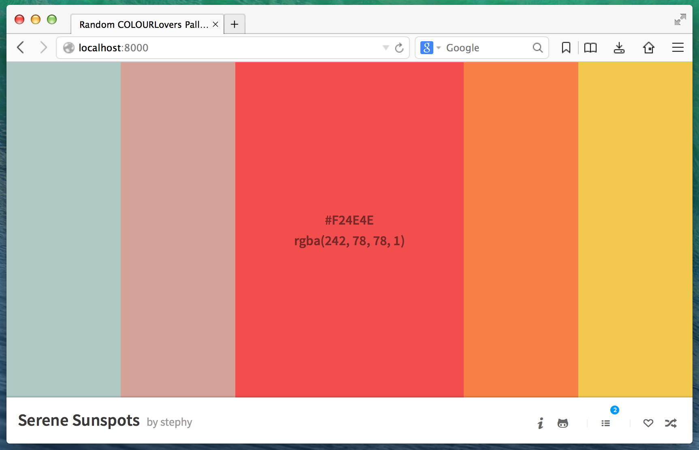

## Random ColourLovers Palettes

A Little project to play around with AngularJS while having some fun.

Color palettes are powered by the [COLOURlovers API](http://www.colourlovers.com/api).

## License
MIT © [Noel Delgado](http://pixelia.me/)
